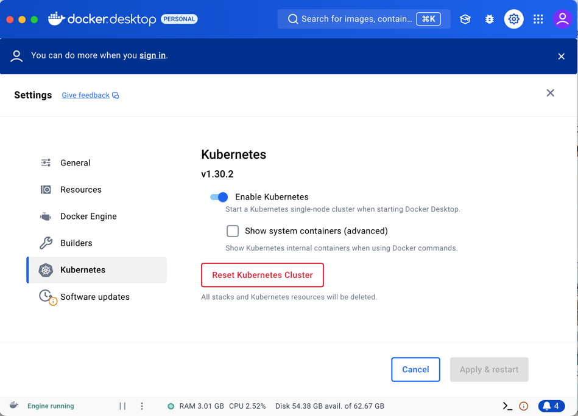

# knative-hackathon

Установка окружения

1. Установлен Docker Desktop версии > 4.35.  
2. Влючена feature Kubernetes (k8s vesion > 1.30). Если k8s использовался ранее, необходимо прожать `Reset kubernetes cluster`
  
3. Для платформ linux и macos выполнить установочный скрипт install_knative_1_17.sh [install_knative_1_17.sh](install_knative_1_17.sh)
   
